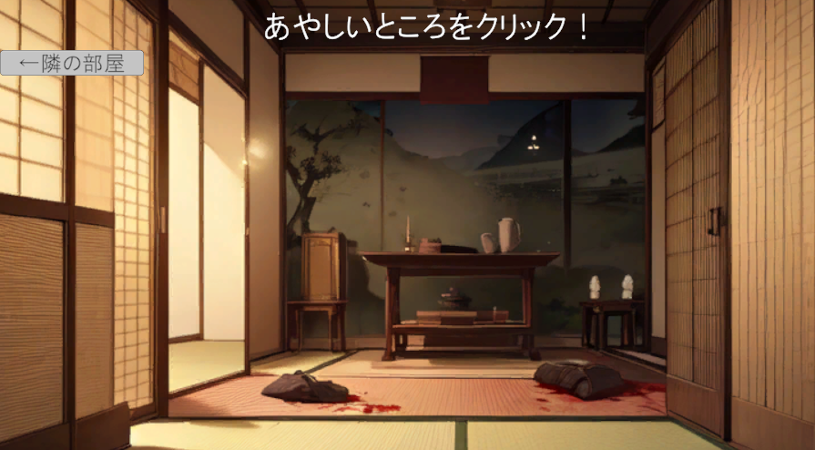

# Beyond The Pale Of Vengeance

> 菊池寛「恩讐の彼方に」をモチーフにしたUnity製ノベルゲーム

## 📖 プロジェクト概要

本作は、菊池寛の名作「恩讐の彼方に」の冒頭部分をゲーム化した2Dノベルゲームです。  
主人公の視点で物語が展開し、探索要素と選択肢によって2つの異なるエンディングへと分岐します。

## ✨ 主な機能

- **ノベルパート**: エンターキーで進行するテキスト表示システム
- **探索パート**: 部屋を探索して物語を進めるインタラクティブ要素
- **分岐システム**: プレイヤーの選択によって2種類のエンディングへ分岐
  - バッドエンディング
  - グッドエンディング
- **1文字ずつ表示**: タイプライター風のテキスト表示演出

## 🛠️ 技術スタック

- **エンジン**: Unity 2D (2022.3)
- **UI**: TextMeshPro
- **データ管理**: ScriptableObject
- **言語**: C#

## 🎯 このゲーム制作で学んだこと

### ScriptableObjectの重要性

このプロジェクトを通じて、**ScriptableObject**の重要性を実感しました。もっと早く学べばよかったと感じるほど、ゲーム開発において非常に強力なツールです。

- ストーリーデータを構造化して管理
- デザイナーがUnityエディタ上で直接データを編集可能
- コードとデータの分離による保守性の向上
- 複数のストーリーシーンを効率的に管理

詳細な実装方法については、[開発メモ（Note）](https://note.com/gentle_dietes302/n/n55bc7b3eef6b)で公開しています。

## 🚀 今後の展望

- **AIの活用**: AIを活用してよりリッチなゲーム体験を提供できるようになりたい
  - 動的なストーリー生成
  - キャラクター対話の拡張
  - コンテンツ生成の自動化

## 📸 スクリーンショット

### ノベルエリア

### 探索エリア

## 📝 開発メモ

制作過程での学びや技術的な詳細は、以下のNote記事で公開しています：

[📌 Unityでノベルゲームを作ろう - ScriptableObjectを使った実装メモ](https://note.com/gentle_dietes302/n/n55bc7b3eef6b)

## 📄 ライセンス

本作は菊池寛「恩讐の彼方に」（青空文庫）をモチーフにしています。

---

**制作期間**: 2024年  
**プラットフォーム**: UnityRoom対応（960×540）